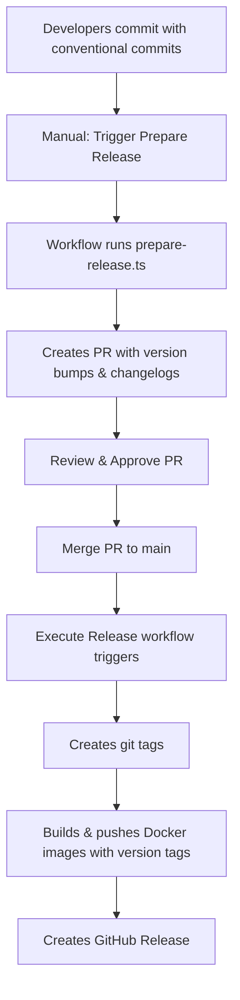
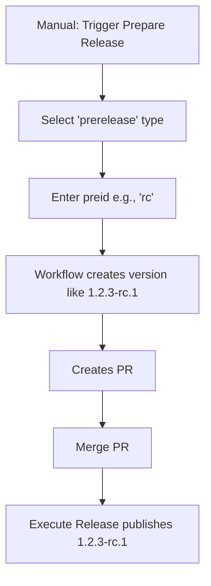

# Release Strategy Documentation

## 🎯 Overview

This repository implements a **Two-Path CI/CD Pipeline** using GitHub Actions and Nx Release APIs:

1. **Dev CI Path**: Keeps `main` branch healthy and updates development environment with `latest` Docker images
2. **Release Path**: Manually triggered workflow that creates versioned releases with proper git tags and Docker images

---

## 🔄 Release Workflows

### 1️⃣ Prepare Release (Manual Trigger)

**File**: `.github/workflows/prepare-release.yml`

This workflow is manually triggered to prepare a new release.

**Trigger**: Manual via GitHub Actions UI

**Inputs**:
- `release_type`: patch | minor | major | prerelease
- `preid`: Pre-release identifier (e.g., rc, alpha, beta) - only used with prerelease type

**What it does**:
1. Runs `tools/scripts/prepare-release.ts` to calculate versions based on conventional commits
2. Updates `package.json` files with new versions
3. Generates/updates `CHANGELOG.md` files
4. Creates a Pull Request with these changes
5. PR title: `chore(release): publish {version}`
6. PR commit message: `chore(release): publish {version} [skip ci]`

**Usage**:
```bash
# Via GitHub UI:
1. Go to Actions tab
2. Select "Prepare Release" workflow
3. Click "Run workflow"
4. Choose release type and optional preid
5. Click "Run workflow" button
```

---

### 2️⃣ Execute Release (Automatic on PR Merge)

**File**: `.github/workflows/execute-release.yml`

This workflow automatically runs when a release PR is merged to `main`.

**Trigger**: Push to `main` branch with commit message matching `chore(release): publish {version} [skip ci]`

**What it does**:
1. Detects release commit by checking commit message format
2. Extracts version number from commit message
3. Runs `tools/scripts/publish-release.ts` to create git tags
4. Builds affected projects
5. Builds and pushes Docker images with:
   - Version-specific tag (e.g., `1.2.3`)
   - `latest` tag
6. Creates a GitHub Release with release notes

**Docker Images Published**:
- `ethanelliottio/finances:{version}` and `ethanelliottio/finances:latest`
- `ethanelliottio/finances-frontend:{version}` and `ethanelliottio/finances-frontend:latest`
- `ethanelliottio/test-server:{version}` and `ethanelliottio/test-server:latest`
- `ethanelliottio/aritzia-scanner:{version}` and `ethanelliottio/aritzia-scanner:latest`
- `ethanelliottio/wheel:{version}` and `ethanelliottio/wheel:latest`
- `ethanelliottio/landing:{version}` and `ethanelliottio/landing:latest`

---

### 3️⃣ Dev CI (Automatic)

**File**: `.github/workflows/ci.yml`

This workflow runs on all pushes to `main` and PRs, except for release commits.

**Trigger**: 
- Push to `main` (skips if release commit)
- Pull requests

**What it does**:
1. Checks if commit is a release commit (if so, skips)
2. Runs lint and build on affected projects
3. On `main` push: Builds and pushes Docker images with `latest` tag

---

## 📝 Release Process Flow

### For Regular Releases (patch/minor/major)



### For Pre-releases (RC/Alpha/Beta)



---

## 🛠 Scripts

### `tools/scripts/prepare-release.ts`

Prepares a release by calculating versions and generating changelogs.

**Usage**:
```bash
# Interactive (prompts for type)
npm run release:prepare

# With arguments
npm run release:prepare -- --type=minor
npm run release:prepare -- --type=prerelease --preid=rc

# Dry run (preview changes without modifying files)
npm run release:prepare:dry-run

# With environment variables
RELEASE_TYPE=patch npm run release:prepare
RELEASE_TYPE=prerelease PREID=alpha npm run release:prepare
```

**What it does**:
1. Calculates new versions based on conventional commits
2. Updates `package.json` files
3. Generates changelog entries
4. Does NOT commit or tag (handled by CI)

### `tools/scripts/publish-release.ts`

Publishes a release by creating and pushing git tags.

**Usage**:
```bash
# Publish release
npm run release:publish

# Dry run
npm run release:publish:dry-run
```

**What it does**:
1. Creates git tags for all released projects
2. Pushes tags to remote
3. Used by Execute Release workflow

---

## 🏷️ Conventional Commits

This repository uses conventional commits to automatically determine version bumps:

- `feat:` → Minor version bump (0.X.0)
- `fix:` → Patch version bump (0.0.X)
- `feat!:` or `BREAKING CHANGE:` → Major version bump (X.0.0)
- Other types (`chore:`, `docs:`, `style:`, etc.) → No version bump

**Examples**:
```bash
# Patch release
git commit -m "fix: resolve login issue"

# Minor release
git commit -m "feat: add dark mode support"

# Major release
git commit -m "feat!: redesign API endpoints"
# or
git commit -m "feat: redesign API

BREAKING CHANGE: API endpoints have changed"
```

---

## 🐳 Docker Image Tagging

### Independent Project Versioning

Each app in the monorepo is versioned independently:

- `apps/finances` → `finances@1.2.3`
- `apps/server` → `server@2.0.0`
- `apps/finances-frontend` → `finances-frontend@1.1.0`

### Docker Tag Strategy

1. **Development (Dev CI)**:
   - Tag: `latest`
   - Pushed on every main commit (non-release)
   - Used for dev/staging environments

2. **Release (Execute Release)**:
   - Tags: `{version}` and `latest`
   - Example: `finances:1.2.3` and `finances:latest`
   - Pushed when release PR is merged

### Parameterized Container Targets

All `project.json` container targets accept a `tag` argument:

```bash
# Build with custom tag
npx nx run finances:container --tag=1.2.3

# Build with latest tag
npx nx run finances:container --tag=latest

# Using configuration
npx nx run finances:container:latest
```

---

## 🔒 GitHub Permissions

### Required Secrets

Configure these in GitHub Repository Settings → Secrets and variables → Actions:

- `DOCKERHUB_USERNAME`: Docker Hub username
- `DOCKERHUB_TOKEN`: Docker Hub access token
- `GITHUB_TOKEN`: Automatically provided by GitHub Actions

### Workflow Permissions

- **Prepare Release**: `contents: write`, `pull-requests: write`
- **Execute Release**: `contents: write`, `packages: write`
- **Dev CI**: `contents: read`, `actions: read`

---

## 📋 Step-by-Step Release Guide

### Creating a Patch Release

1. **Ensure commits follow conventional commits**
   ```bash
   git commit -m "fix: resolve authentication bug"
   git push origin main
   ```

2. **Trigger Prepare Release**
   - Go to GitHub Actions tab
   - Select "Prepare Release"
   - Click "Run workflow"
   - Select `patch` as release type
   - Click "Run workflow"

3. **Review the PR**
   - Workflow creates a PR with version bumps and changelogs
   - Review changes in `package.json` and `CHANGELOG.md`
   - Approve if everything looks good

4. **Merge the PR**
   - Use **"Squash and merge"**
   - Execute Release workflow triggers automatically

5. **Verify Release**
   - Check GitHub Releases for new release
   - Verify Docker images are published
   - Check git tags are created

### Creating a Pre-release (RC)

1. **Trigger Prepare Release**
   - Go to GitHub Actions
   - Select "Prepare Release"
   - Click "Run workflow"
   - Select `prerelease` as release type
   - Enter `rc` as preid
   - Click "Run workflow"

2. **Review and Merge PR**
   - PR will show version like `1.2.3-rc.1`
   - Use **"Squash and merge"**

3. **Release is Published**
   - Docker images tagged as `1.2.3-rc.1` and `latest`
   - GitHub Release marked as pre-release

### Promoting RC to Stable

1. **Trigger Prepare Release**
   - Select `patch`, `minor`, or `major` (usually `patch` if RC → Stable)
   - This will bump `1.2.3-rc.1` → `1.2.3`

2. **Merge PR**
   - Release published as stable

---

## 🔍 Troubleshooting

### "No version changes detected"

**Cause**: No conventional commits since last release, or all projects already at target version.

**Solution**: 
- Check commit history: `git log --oneline`
- Ensure commits follow conventional commit format
- Verify you haven't already released these changes

### Docker build fails

**Cause**: Missing Dockerfile or build configuration issues.

**Solution**:
- Verify Dockerfile exists in `apps/{project}/Dockerfile`
- Test Docker build locally: `docker build -f apps/{project}/Dockerfile .`
- Check project.json has `container` target

### Release PR not created

**Cause**: Prepare Release workflow failed.

**Solution**:
- Check workflow logs in GitHub Actions
- Verify `prepare-release.ts` script runs locally
- Ensure GitHub token has correct permissions

### Execute Release didn't trigger

**Cause**: Commit message format doesn't match expected pattern.

**Solution**:
- Ensure PR merged with "Squash and merge"
- Verify PR title is exactly: `chore(release): publish {version}`
- The PR title becomes the squashed commit message
- Check Execute Release workflow logs

---

## 🎓 Advanced Usage

### Testing Release Process Locally

```bash
# Dry run prepare release
npm run release:prepare:dry-run -- --type=patch

# Dry run publish release
npm run release:publish:dry-run

# Test Docker build with custom tag
npx nx run finances:container --tag=test-1.0.0
```

### Releasing Specific Projects

The current setup releases all affected projects. To release specific projects, you would need to modify `nx.json`:

```json
{
  "release": {
    "projects": ["apps/finances", "apps/server"],
    // ...
  }
}
```

### Custom Version Calculation

Modify `tools/scripts/prepare-release.ts` to implement custom version calculation logic if needed.

---

## 📚 References

- [Nx Release Documentation](https://nx.dev/features/manage-releases)
- [Conventional Commits](https://www.conventionalcommits.org/)
- [Semantic Versioning](https://semver.org/)
- [GitHub Actions Documentation](https://docs.github.com/en/actions)

---

## 🤝 Contributing

When contributing:
1. Follow conventional commit format
2. Ensure CI passes before merging
3. Update documentation if changing release process
4. Test release process in feature branches when possible

---

Last Updated: December 31, 2025
